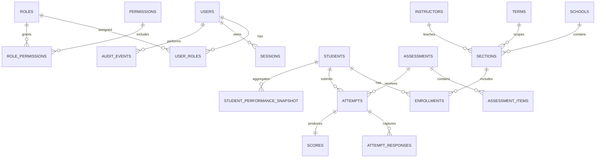

# Data Model

This document describes the baseline relational model across auth, SIS, assessments, analytics, and audit logging.

## ERD

## Relation Notes

### Auth

- `users` ↔ `user_roles` ↔ `roles` defines RBAC assignments.
- `roles` ↔ `role_permissions` ↔ `permissions` defines capability grants.
- `sessions.user_id` links active refresh-token sessions to users.

### SIS

- `sections` belong to `schools` and `terms`.
- `enrollments` is a join entity between `students` and `sections`.
- `sections.instructor_id` links classes to teacher records.

### Assessments

- `assessment_items` are child rows under `assessments`.
- `attempts` belong to both `assessments` and `students`.
- `attempt_responses` are item-level records under an `attempt`.
- `scores` keeps canonical scoring outcome per attempt.

### Analytics

- `student_performance_snapshot` is a denormalized read model keyed by `student_id`.
- Snapshot rows can be rebuilt from attempts/scores and SIS enrollments.

### Audit Logging

- `audit_events.actor_id` references `users.id`.
- `audit_events` should be append-only; corrections are additive via compensating events.
